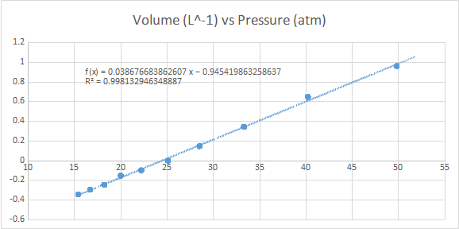
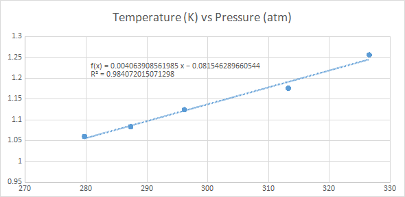

<!-- https://www.tablesgenerator.com/markdown_tables# -->

# Experiment 5: Gas Laws

Illinois Institute of Technology

Henry Post and William Gaylord

Zabel H. Panosyan

03/13/19

# Objective

To obtain the molar mass of air, the ambient air pressure, and to estimate
absolute zero temperature.

# Procedures

The valve of a Boyle's Law apparatus (an adjustable pressure chamber with a
temperature sensor) is opened to expose the pressure chamber to the lab's
atmosphere, and the screw piston is adjusted to $40mL$. The valve is closed, and
the volume, pressure, and temperature are all recorded. The screw piston is then
set to various intervals of $5mL$, and the recording of the volume, pressure,
and temperature is repeated.

The stopcock of a Charles' Law apparatus (a jar) is opened and a syringe is used
to insert air into the jar until the pressure is between $100mmHg$ and
$150mmHg$. The stopcock is closed and the temperature and pressure are recorded.
The temperature is then altered by placing the jar into hot water. It is
recorded at various intervals, and then the same is done with an ice bath.

An empty $1L$ bottle with a gas valve cap attached is weighed and its weight
recorded. The bottle is then filled with air from a bicycle pump (2-3 strokes).
Its pressure is measured with a digital tire pressure gauge, and then the
pressurized bottle is weighed. This trial is repeated. The bottle is then filled
with water, and the full bottle (and cap) are all weighed.

<!-- No post-lab, hooray! -->
<!-- ## Post-lab -->

## Conclusion

In this lab, we explored the way that pressure, temperature, and volume all
affected each other. We recorded multiple graphs and saw that volume and
pressure were inversely related variables in $PV=nRT$, and that temperature and
pressure were directly related variables.

## Result

Absolute zero was calculated to be $19.87K$.

The molar mass of air was calculated to be ${20g}/{mol}$

The average number of moles of air measured in the Boyle's Law experiment was
calculated to be $7.5 \times {10}^{-5} mol\ \mathrm{air}$.

## Charts

